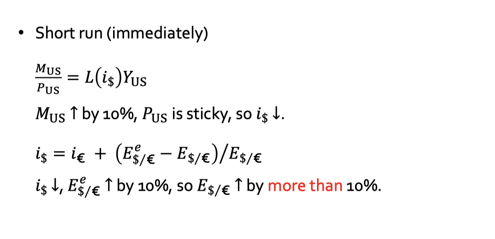
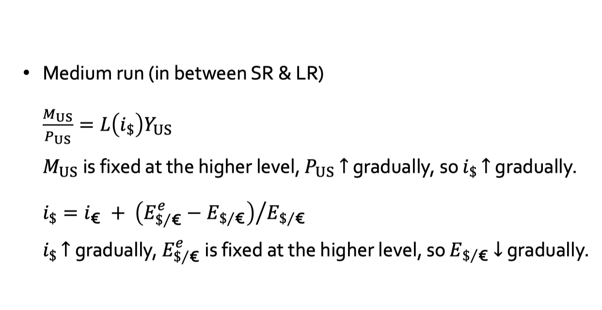
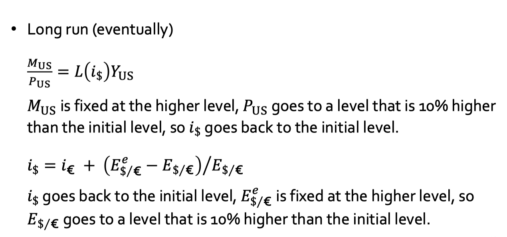
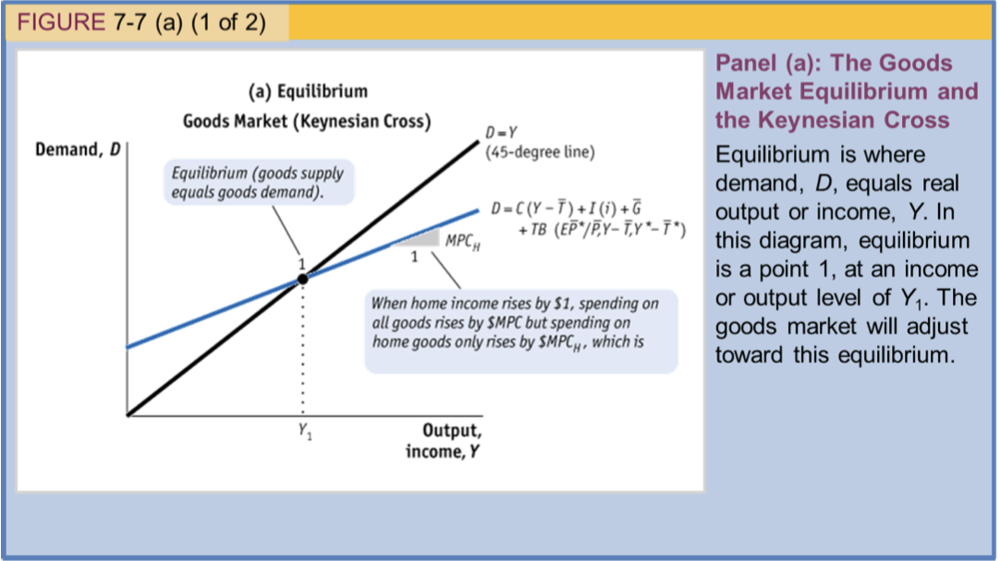
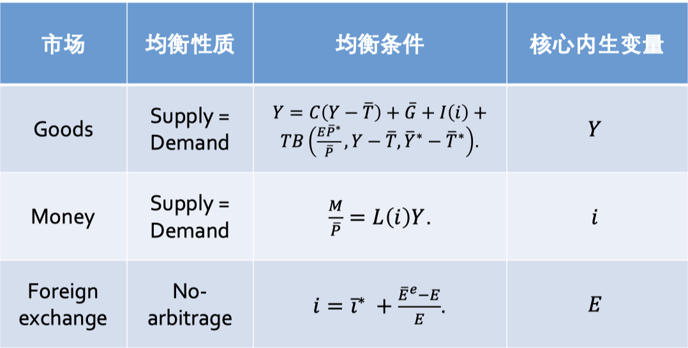

# lecture 2

## 1 汇率基础

- 直接标价法：每一个外币可以拿到的本币 $E_{¥/\$}$

  - 直接标价法下，汇率上升说明本币贬值，汇率下降说明汇率升值
- 间接标价法：每一个本币可以拿到的外币 $E_{\$/¥}$
- 汇率的两个方面：商品的价格和资产的收益
- 经验法则：花钱决策不受使用的货币影响，存钱决策也不受影响
- 贸易条件（Terms of Trade）：一个国家出口的商品价格与进口商品价格的比率
- 有效汇率：使用贸易权重计算的加权平均汇率，这样的话有效汇率的变化率是使用贸易权重计算的加权平均汇率变化率

## 2 汇率制度

- 固定利率：政府设定一个汇率，允许在这个汇率附近有一个小的波动范围
- 浮动利率：政府不设定汇率，允许汇率自由波动

## 3 外汇市场

- 美元是 vehicle currency，三个主要的外汇交易中心是伦敦、纽约和东京
- Spot contract：即期合约，交易双方在交易日当天交割，占外汇市场大多数
- Forward contract：远期合约，交易双方在未来某个时间交割
  - 在直接标价法下，$F>E$，称为远期贴水
  - 在直接标价法下，$F<E$，称为远期升水
- Swaps：掉期，即期加远期合约

## 4 套利

- 两地套利：汇率和所在地无关
- 三角套利：$E_{\pounds/\$} = E_{\pounds/¥} E_{¥/\$}$

## 5 利率平价条件

- UIP：$i_\dollar=i_\euro+(E^e_{\dollar/\euro}-E_{\dollar/\euro})/(E_{\dollar/\euro}$
- CIP：$i_\dollar=i_\euro+(F_{\dollar/\euro}-E_{\dollar/\euro})/(E_{\dollar/\euro}$

# lecture 3

## 1 一价定律

- 一个商品，一个价格

## 2 购买力平价

- PPP：对同样的商品篮子运用一价定律
- 绝对购买力平价：$E_{\dollar/\euro} = P_\dollar / P_\euro$
- 相对购买力平价：$\frac{E_{\dollar/\euro,t+1}-E_{\dollar/\euro,t} }{E_{\dollar/\euro,t}}= \pi_{\dollar, t+1} - \pi_{\euro, t+1}$

PPP 失效的原因：

- 非卖品
- 交易成本
- 不完全竞争
- 价格粘性和狂暴汇率

## 3 货币和货币供给

货币总量完全由央行控制

## 4 长期货币市场均衡

### 4.1 简单版本

$$
M=M^{d}=\bar LPY
$$

通胀决定式

$$
\pi=\mu-g
$$

通常假设产出不变

### 4.2 通常版本

$$
M=M^{d}=L(i)PY
$$

$$
r^{e}=i-\pi^{e},\pi^{e}=\frac{P^{e}-P}{P}
$$

几条假设：

- 一步调整到位原则
- 稳定增长状态下名义利率为常数，故 L 为常数 $\pi=\mu-g$
- 稳定增长状态下预期与实际相符，$\pi^{e}=\pi_{+1}=\pi$

## 5 长期模型下的汇率：货币法

- 长期来看汇率由价格决定
- 长期来看，价格由货币供应和真实货币需求决定

### 5.1 简单版本

$$
E_{\dollar/\euro}=\frac{M_\dollar/M_\euro}{\bar LY_{US}/\bar LY_{EU}}
$$

所以可以得到

$$
\frac{E_{\dollar/\euro,t+1}-E_{\dollar/\euro,t}}{E_{\dollar/\euro,t}}=(\mu_\dollar-\mu_\euro)-(g_{US}-g_{EU})
$$

### 5.2 通常版本

$$
E_{\dollar/\euro}=\frac{M_\dollar/M_\euro}{L(i_\dollar)PY_\dollar/L(i_\euro)PY_\euro}
$$

所以可以得到

$$
\frac{E_{\dollar/\euro,t+1}-E_{\dollar/\euro,t}}{E_{\dollar/\euro,t}}=(\mu_\dollar-\mu_\euro)-(g_{US}-g_{EU})
$$

国际费雪效应：名义利率差等于预期通胀率差，可以通过 UIP 条件和 PPP 条件得到

## 6 实际汇率

- 直接标价法下： $Q_{US/ Eu}=\frac{EP_{EU}}{P_{US}}$
- 实际汇率贬值，$Q_{US/ EU}$ 上升；实际汇率升值，$Q_{US/ EU}$ 下降
- PPP 成立，则真实汇率等于 1

## 7 巴萨假说

$$
RY_{i/US} = \frac{GDP_{i}/(P_{i}/P_{US})}{GDP_{US}}\frac{POP_{US}}{POP_{i}}
$$

$$
Q_{US/i}=(P_{i}/P_{US})E_{i/\$}
$$

宾大效应：$RY_{i/US}$ 和 $Q_{US/i}$ 存在正向线性关系
巴萨假说：RER 主要由国家间贸易部门和非贸易部门的相对生产力决定

- 两个国家，分别两个部分
- 劳动力可以在部门之间自由流动但是不能跨国流动
- 非贸易部门生产能力恒定
- 对于本国商品，一价定律成立
  生产方程：

$$
Y_{T} = A_{T}L_{T}, Y_{N} = A_{N}L_{N}, Y^*_{T} = A^*_{T}L^*_{T}, Y^*_{N} = A^*_{N}L^*_{N}
$$

完全竞争下的价格水平

$$
P_{T}=\frac{W}{A_{T}}, P_{N}=\frac{W}{\bar A_{N}}, P^*_{T}=\frac{W^*}{A^*_{T}}, P^*_{N}=\frac{W^*}{\bar A^*_{N}}
$$

一价定律：

$$
P_{T}=EP^{*}_{T}\Rightarrow \frac{W}{EW^*}=\frac{A_{T}}{A^*_{T}}
$$

总价格：

$$
P=(P_{N})^{\alpha}(P_{T})^{1-\alpha},P^*=(P^*_{N})^{\alpha}(P^*_{T})^{1-\alpha}
$$

消费比例相同：

$$
\frac{P_{T}C_{T}}{P_{N}C_{N}}=\frac{P^*_{T}C^*_{T}}{P^*_{N}C^*_{N}}=1-\alpha
$$

公平贸易：

$$
C_{T}=Y_{T}, C_{T}^*=Y^*_{T}
$$

非交易部门市场出清：

$$
C_{N}= Y_N, C^*_{N}= Y^*_{N}
$$

可以得到的结论：

$$
\frac{L_{T}}{L_{N}}=\frac{L^*_{T}}{L^*_{N}}=\frac{1-\alpha}{\alpha}
$$

$$
Q = \left(\frac{A_{T}/A_{N}}{A^{*}_{T}/A^{*}_{N}}\right)^{\alpha}
$$

# Lecture 4

## 1 外汇市场均衡

UIP 条件

## 2 短期外汇市场均衡

$$
M=M^{d}=L(i)\bar PY,\Leftrightarrow \frac{M}{\bar P}=\frac{M^{d}}{\bar P} = L(i)Y,where~ L'(i)<0
$$

## 3 资产法

$$
\begin{cases} 
\frac{M_{US}}{\bar P_{US}}=L(i_{US})Y_{US} \\
\frac{M_{EU}}{\bar P_{EU}}=L(i_{EU})Y_{EU} \\
i_\$ = i_\euro + \frac{E^e_{\$/\euro}-E_{\$/\euro}}{E_{\$/\euro}} 
\end{cases}
$$

## 4 超调模型

Assumptions:

- 最开始是稳定增长的，短暂调整之后回到稳定增长状态
- 两国实际利率相等
- 所有实际变量给定
- 所有外国变量给定
- $P_{US}$ 短期内有粘性，但是长期来看会收敛到 $P_{US}^{SS}$
- $E^{e}$ 迅速调整到新的 $E^{SS}$ 并且保持不变
  
  
  

## 5 货币收入模型：长期表达式

假设：

1. PPP
2. UIP
3. 货币市场出清
   稳定系统

- $s_{t}=p_{t}-p_{t}^*$
- $E_{t}(s_{t+1})-s_{t}=i_{t}-i^{*}_{t}$
- $m_{t}-p_{t}=\gamma y_{t}-\alpha i_{t}$
  计算可以得到

$$
s_{t}=(1-b)\sum\limits_{j=0}^{\infty}b^{j}E_{t}[(m_{t+j}-p_{t+j})-\gamma(y_{t+j}-y^{*}_{t+j})]
$$

## 6 固定汇率与不可能三角

浮动汇率下，传导路径是 $M\to i\to E$
固定汇率下，传导路径是 $E\to i\to M$

# lecture 5

- GNE：国民总支出，$GNE = C+G+I$
- GDP：国内生产总值，$GDP =GNE+TB$
  - TB：贸易差额，$TB = EX - IM$
- GNI：国民总收入，$GNI = GDP + NFIA$
  - NFIA：净要素收入，$NFIA = EX_{FS}-IM_{FS}$
- GNDI：国民总可支配收入，$GNDI = GNI + NUT$
  - NUT：净转移支付，$NUT = UT_{+}-UT_{-}$

## 1 经常账户 CA

- 经常账户 CA：$CA = TB + NFIA + NUT$
- TB 是 CA 最重要的部分
- $GNDI = C+G+I+CA$
- 经常账户恒等式：$S=GNDI-(C+G)=I+CA$

## 2 金融账户 FA 和资本账户 KA

- 金融账户 FA：$FA = EX_{A}-IM_{A}$
- 资本账户 KA：$KA = KA_{IN}-KA_{OUT}$

## 3 国际收支余额 BOP

记账的法则：

- 真金白银法则：记在 TB、NFIA、FA
- 爱的法则：记在 NUT、KA
  国际收支恒等式

$$
CA+FA+KA=0
$$

金融账户分解$FA=NRFA+OSB$

- NRFA：非储备金融资产
- OSB：官方储备资产
- 国际收支余额：$BOP=CA+NRFA+KA$

# Lecture 6

## 1 金融全球化的收益

金融封闭，则该国收支平衡
一国长期预算约束式，假设净财富 $W$

- 假设
  - NUT = 0
  - NFIA 只包括净投资收入
  - KA =0
  - 世界上只有一种商品
  - 世界上只有一种资产
  - 资本损益为 0，$\Delta W = CA$
- 运动方程：$\Delta W_{t}=W_{t}-W_{t-1}=TB_{t}+r^{w}W_{t-1}$
- 长期预算约束式：$-(1+r^{w})W_{-1}=\sum\limits_{j=0}^{\infty}\frac{TB_{j}}{(1+r^{w})^{j}}$
- 也可以写成 $-(1+r^{w})W_{-1}+\sum\limits_{j=0}^{\infty} \frac{GDP_{j}}{(1+r^{w})^{j}}=\sum\limits_{j=0}^{\infty}\frac{GNE_{j}}{(1+r^{w})^{j}}$

## 2 金融全球化的风险

# Lecture 7

## 1 商品市场均衡

本国商品总需求

$$
D=C+\bar G+I +TB=C+\bar G+I+CA
$$

可支配收入

$$
C= C(Y-\bar T), MPC=C'(Y-\bar T)\in(0,1)
$$

政府消费

- 预算平衡 $\bar G=\bar T$
- 预算赤字 $\bar G>\bar T$
- 预算盈余 $\bar G<\bar T$
  投资

$$
I=I(i),I'(i)<0
$$

贸易余额

$$
TB=TB(\frac{E\bar P^{*}}{\bar P}, Y-\bar T, \bar Y^{*}-\bar T^{*}),TB_{1}>0,,TB_{2}<0,TB_{3}>0
$$

总需求

$$
D = C(Y-\bar T)+\bar G+I(i)+TB(\frac{E\bar P^{*}}{\bar P}, Y-\bar T, \bar Y^{*}-\bar T^{*})
$$

$$
\frac{\partial D}{\partial (Y-\bar T)}\in(0,1),
\frac{\partial D}{\partial \bar G}>0,\frac{\partial D}{\partial i}<0,\frac{\partial D}{\partial E\bar P^{*}/\bar P}>0,\frac{\partial D}{\partial (\bar Y^{*}-\bar T^{*})}>0
$$

凯恩斯交叉

## 2 IS曲线

商品市场均衡条件

$$
Y = C(Y-\bar T)+\bar G+I(i)+TB(\frac{E\bar P^{*}}{\bar P}, Y-\bar T, \bar Y^{*}-\bar T^{*})
$$

外汇市场均衡条件

$$
i=\bar i^*+\frac{E^e-E}{E}
$$

于是，可以得到

$$
Y = IS(i; \bar G, \bar T,\bar i^{*},\bar E^{e}, \bar P^{*}, \bar P, \bar Y^{*}, \bar T^{*} )
$$

## 3 LM曲线

货币市场均衡

$$
M/ \bar P = L(i,Y-\bar T)
$$

于是可以得到

$$
i = LM(Y; M, \bar P)
$$

## 4 IS-LM-FX模型

## 5 稳定化政策

## 6 流动性陷阱

- 名义利率有零下限约束

# lecture 8

## 1 中国汇率制度沿革

- 1981-1993，双轨制
- 1994 年第一次汇改，干预而不再决定操控价格
- 1997-2005，盯住美元，8.28
- 2005 年第二次汇改，管理浮动，一篮子货币、浮动区间
- 2005-2015，管理浮动汇率制
- 2015 年第三次汇改，完善中间汇率形成机制

## 2 人民币低估说

# lecture 11

## 1 汇率制度

汇率制度选择：一体化程度 V.S. 相似度

- 一体化程度：稳定汇率有利于贸易
- 相似度：固定汇率使得钉住国丧失货币政策独立性，但是两国相似度越高，就越不需要货币政策独立性

## 2 汇率系统

利率合作：钉住国和被钉住国采取相类似的货币政策

# lecture 13

## 1 汇率危机

- 汇率危机：汇率大幅贬值，对于钉住汇率制的国家，往往 5 年左右崩盘，政府被迫放弃钉住汇率制，崩盘瞬间大幅贬值

## 2 固定汇率制

假设

- 开放小国：$i^*$ 为常数，$P^{*}=1$
- UIP 条件：$i = i^{*}+(E^{e}-E)/E$
  - 钉住汇率制下，$E^{e}=E=1$ 可信承诺
  - 浮动汇率制下，$E^{e}=E_{+1}$ 完美预期
- PPP 条件：$P = EP^{*}$
- 货币市场出清：$M/P = L(i)Y$
- 简化版央行资产负债表：$M = B+R$，其中 B 是央行持有的国债，不受央行决定，R 是央行的外汇储备，R/M 是支持比率
  可以得到钉住汇率制下
- UIP 条件 $\Rightarrow$ $i^*=i$
- PPP 条件 $\Rightarrow$ $P=1$
- 货币市场出清 $\Rightarrow$ $M = L(i^{*})Y$
- 央行资产负债表 $\Rightarrow$ $R = L(i^{*})Y-B>0$
- 支持比率定义 $\Rightarrow$ $\frac{R}{M}= 1- \frac{B}{[L(i^{*})Y]}\in(0,1)$
  钉住汇率制下央行对外生变化的反应以及后果

$$
\begin{aligned}
&M=L(i^{*})Y \Rightarrow  \frac{\partial M}{\partial Y }>0, \frac{\partial M}{\partial i^{*}}<0 , \frac{\partial M}{\partial B}=0 \\
& R = L(i^{*})Y-B \Rightarrow  \frac{\partial R}{\partial Y }>0, \frac{\partial R}{\partial i^{*}}<0 , \frac{\partial R}{\partial B}=-1 \\
& \frac{R}{M}= 1- \frac{B}{[L(i^{*})Y]} \Rightarrow \frac{\partial (R/M)}{\partial Y }>0, \frac{\partial (R/M)}{\partial i^{*}}<0 , \frac{\partial (R/M)}{\partial B}=-\frac{1}{L(i^{*})Y}<0
\end{aligned}
$$

## 3 第一代汇率危机

- 钉住汇率制下，M 与 B 无关，在 (M, B) 平面上是垂直线
- 浮动汇率制下，M = B，45 度线，谓之浮动线

短视或完美预期

- 短视：危机在外汇储备自然耗尽的那一刻爆发，货币供给水平不变
- 完美预期：危机在外汇储备耗尽之前爆发，关键是那一瞬间汇率不变，货币供给水平下降

## 4 第二代汇率危机

相机承诺：只有当信守承诺的获益高于成本的时候，行为主体才会言行一致
有两种钉住：可信的和不可信的

- 可信的：市场相信下一期还会钉住
- 不可信的：市场相信下一期将要被放弃
- 不可信钉住的成本高于可信钉住的成本

# lecture 14
